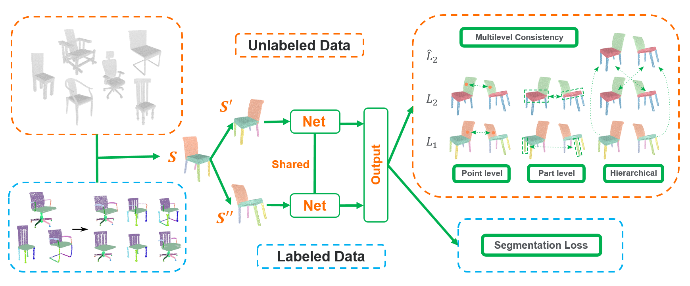

# Semi-Supervised 3D Shape Segmentation with Multilevel Consistency and Part Substitution




## Introduction

This work is based on our CVM 2022 paper. We proposed a semi-supervised learning method for 3D shape semantic segmentation. You can check our [project webpage](https://isunchy.github.io/projects/semi_supervised_3d_segmentation.html) for a quick overview.

The lack of fine-grained 3D shape segmentation data is the main obstacle to developing learning-based 3D segmentation techniques. We propose an effective semi-supervised method for learning 3D segmentations from a few labeled 3D shapes and a large amount of unlabeled 3D data. For the unlabeled data, we present a novel multilevel consistency loss to enforce consistency of network predictions between perturbed copies of a 3D shape at multiple levels: point-level, part-level, and hierarchical level. For the labeled data, we develop a simple yet effective part substitution scheme to augment the labeled 3D shapes with more structural variations to enhance training. Our method has been extensively validated on the task of 3D object semantic segmentation on PartNet and ShapeNetPart, and indoor scene semantic segmentation on ScanNet. It exhibits superior performance to existing semi-supervised and unsupervised pre-training 3D approaches.

In this repository, we release the code and data for training the semi-supervised networks for 3d shape semantic segmentation.

## Citation

If you use our code for research, please cite our paper:
```
@article{sun2022semi,
  title     = {Semi-Supervised 3D Shape Segmentation with Multilevel Consistency and Part Substitution},
  author    = {Sun, Chunyu and Yang, Yiqi and Guo, Haoxiang and Wang, pengshuai and Tong, Xin and Liu, Yang and Shum Heung-Yeung},
  journal   = {Computational Visual Media},
  year      = {2022},
  publisher = {Springer}
}
```

## Setup


        docker pull tensorflow/tensorflow:1.15.0-gpu-py3
        docker run -it --runtime=nvidia -v /path/to/semi_supervised_3d_segmentation/SemiSemanticNet/:/workspace tensorflow/tensorflow:1.15.0-gpu-py3
        cd /workspace
        pip install tqdm scipy --user


## Experiments


### Data Preparation

We provide the Baidu drive link for downloading the training and test datasets:

>[Training data (extract code: semi)](https://pan.baidu.com/s/1fIy5LvqkqW_Usr5yoDoMyg)

The codes for the part substitution algorithm are put in the folder "PartSubstitution", and you can use them to generate augmented shapes.

### Training

To start the training, run

        $ python SemanticPrimitiveNetSegPartnet.py --logdir log/test_chair --train_data data/PartNet/Chair_ratio02_90_un4489_8978.tfrecords --test_data data/PartNet/Chair_level123_test_1217.tfrecords --test_data_visual data/PartNet/Chair_level123_test_1217.tfrecords --train_batch_size 16 --max_iter 80000 --test_every_iter 5000 --test_iter 1217 --cache_folder test_chair --gpu 0 --n_part_1 6 --n_part_2 30  --n_part_3 39 --phase train --seg_loss_weight 1 --point_consistency_weight 0.01 --part_consistency_weight 0.01 --hierarchy_point_consistency_weight 0.01 --level_1_weight 1 --level_2_weight 1 --level_3_weight 1 --level_32_weight 1 --level_21_weight 1 --learning_rate 0.1 --optimizer sgd --delete_0 --category Chair 

        $ python SemanticPrimitiveNetSegScannet.py --logdir log/test_scannet --train_data data/ScanNet/scannet_train_official_su_12_un_1201.tfrecords --test_data data/ScanNet/scannet_val_312.tfrecords --test_data_visual data/ScanNet/scannet_val_312.tfrecords --train_batch_size 4 --max_iter 60000 --test_every_iter 1000 --test_iter 312 --disp_every_n_steps 60000 --cache_folder test_scannet --gpu 0 --n_part 21 --n_part_1 7 --phase train --seg_loss_weight 1 --point_consistency_weight 0.005 --part_consistency_weight 0.005 --hierarchy_point_consistency_weight 0.005 --level_0_weight 1 --level_1_weight 1 --level_01_weight 1 --learning_rate 0.1 --optimizer sgd --delete_0 --category scene1 --depth 9 --test_shape_average_point_number 160000 --nempty

### Test

To test a trained model, run

        $ python SemanticPrimitiveNetSegPartnet.py --logdir log/test_chair --train_data data/PartNet/Chair_ratio02_90_un4489_8978.tfrecords --test_data data/PartNet/Chair_level123_test_1217.tfrecords --test_data_visual data/PartNet/Chair_level123_test_1217.tfrecords --train_batch_size 16 --max_iter 80000 --test_every_iter 5000 --test_iter 1217 --cache_folder test_chair --gpu 0 --n_part_1 6 --n_part_2 30  --n_part_3 39 --phase test --seg_loss_weight 1 --point_consistency_weight 0.01 --part_consistency_weight 0.01 --hierarchy_point_consistency_weight 0.01 --level_1_weight 1 --level_2_weight 1 --level_3_weight 1 --level_32_weight 1 --level_21_weight 1 --learning_rate 0.1 --optimizer sgd --ckpt weight/PartNet/Chair/02 --delete_0 --category Chair

        $ python SemanticPrimitiveNetSegScannet.py --logdir log/test_scannet --train_data data/ScanNet/scannet_train_official_su_12_un_1201.tfrecords --test_data data/ScanNet/scannet_val_312.tfrecords --test_data_visual data/ScanNet/scannet_val_312.tfrecords --train_batch_size 4 --max_iter 60000 --test_every_iter 1000 --test_iter 312 --disp_every_n_steps 60000 --cache_folder test_scannet --gpu 0 --n_part 21 --n_part_1 7 --phase test --seg_loss_weight 1 --point_consistency_weight 0.005 --part_consistency_weight 0.005 --hierarchy_point_consistency_weight 0.005 --level_0_weight 1 --level_1_weight 1 --level_01_weight 1 --learning_rate 0.1 --optimizer sgd --ckpt weight/ScanNet/01 --delete_0 --category scene1 --depth 9 --test_shape_average_point_number 160000 --nempty

We provide the trained weights used in our paper:

>[Weights (extract code: semi)](https://pan.baidu.com/s/1BlzepfBJzKMV5VnmAbV_mA)


## License

MIT Licence

## Contact

Please contact us (Chunyu Sun sunchyqd@gmail.com, Yang Liu yangliu@microsoft.com) if you have any problem about our implementation.

